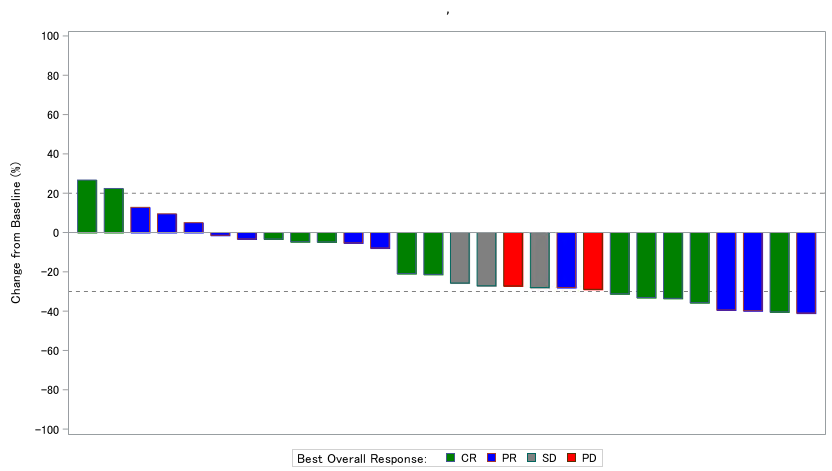

# OncoPlotter (Latest version 0.5.0 on 09February2026)
A SAS package to create figures commonly created in oncology studies  
  

The repository is a collaborative project.
 - **%kaplan_meier_plot**
 - **%swimmer_plot**
 - **%waterfall_plot**
 - **%forest_plot**
 - **%spider_plot**
---

# %kaplan_meier_plot</a> 
 
Macro:       %kaplan_meier_plot 
 
Purpose:     This macro generates Kaplan-Meier survival plots using PROC LIFETEST in SAS. 
              It produces survival curves by group, displays censoring marks, and includes 
              the number at risk at each time point on the plot. 
 
 Features: 
   - Optionally generates an internal example dataset (e.g., `dummy_adtte`) 
   - Customizable group labels, colors, and line patterns 
   - Supports plotting of censored observations 
   - Configurable axis and display settings 
   - Supports MFILE option to export generated SAS code 
 
 Parameters: 
   data=                  Input dataset name (e.g., dummy_adtte) 
   groupn=                Numeric group variable (e.g., TRTPN) 
   groupc=                Character group label variable (e.g., TRTP) 
   wh=                    WHERE condition to subset data (optional) 
   Time_var=              Time-to-event variable (e.g., AVAL) 
   Censore_var=           Censoring indicator variable (e.g., CNSR) 
   Censore_val=           Value indicating censored observations (e.g., 1) 
   Title=                 Plot title (default: "Kaplan-Meier Plot") 
   Group_color_list=      Color list for group lines (e.g., "black red blue green") 
   Group_linepattern_list= Line pattern list for groups (e.g., "solid dash longdash dot") 
   XLABEL=                Label for the X-axis (e.g., "Survival Time (Month)") 
   YLABEL=                Label for the Y-axis (e.g., "Probability of Survival") 
   AxisValues=            Tick marks for the X-axis (e.g., "0 to 16 by 2") 
   Generate_Code=         Option to output MFILE-generated SAS code (Y/N) 
 
 Example usage: 
%kaplan_meier_plot( );
  

 

 
👆When run without specifying anything, it automatically draws with dummy data and even opens plain SAS code as text. 
  
 %kaplan_meier_plot( 
       data = dummy_adtte, 
       groupn = TRTPN, 
       groupc = TRTP, 
       Time_var = AVAL, 
       Censore_var = CNSR, 
       Censore_val = 1, 
       Title = %nrquote(Kaplan-Meier Curve Example), 
       Group_color_list = %nrquote(black red blue green), 
       Group_linepattern_list = %nrquote(solid dash longdash shortdash), 
       XLABEL = %nrquote(Survival Time (Month)), 
       YLABEL = %nrquote(Probability), 
       AxisValues = %nrquote(0 to 15 by 1), 
       Generate_Code = N 
   ); 
   
 

 Author:     Yutaka Morioka 
 Date:        2025-06-24 
 Update Date:  2025-09-18 

# %swimmer_plot</a> 
 
Macro:       %swimmer_plot 
 
Purpose:     This macro generates swimmer's plot using proc sgplot with modern views which address not only CSR figures but also publication figures.   
            You can run the example code below since ADSL_DUMMY and ADRS_DUMMY datasets are created under WORK library when you load OncoPlotter.  
             
~~~sas
%Swimmer_Plot(
	adrs            = adrs_dummy,
	adsl            = adsl_dummy,
	whr_adrs        = PARAM="Overall Response" and PARQUAL="IRC",
	whr_adsl        = FASFL="Y",
	eotvar          = EOTSTT,
	lstvstdt        = ,
	crprN           = 1 2,
	durable         = Y,
	durableLabel    = Durable Period,
	groupvar        = STAGEN,
	groupLabel      = Disease Stage,
	groupN          = 1 2 3 4 5,
	groupC          = Stage I | Stage IIa | Stage IIb | Stage III | Stage IV,
	responseN       = 1 2 3 4,
	responseC       = CR | PR | SD | PD,
	responseLabel   = Response,
	deathLabel      = Death,
	ongoingLabel    = Treatment Ongoing,
	nperpage        = 20,
	width           = 640,
	height          = 480,
	subjidOn        = Y,
	colorStyle      = OncoPlotter, /* Choose from OncoPlotter, Salmon, Kawaii, Kyoto, Osaka */
	groupColor      = ,
	markerColor     = ,
	markerSymbol    = ,
	title           = Swimmer%str(%')s Plot,
	ytitle          = Subject,
	xtitle          = Days from treatment,
	xvalues         = 0 to 40 by 4,
	nolegend        = ,
	interval        = week, /* null for Day. Choose from Week, Month to show week or month view */
	Generate_Code	= Y
)
~~~
**Example 1. colorStyle=OncoPlotter (with durable line)**  
  
**Example 2. colorStyle=Kyoto (without durable line)**  
  
**Example 3. colorStyle=Kawaii (Portlait view adjusted by width/height)**   
  

 Author:     Ryo Nakaya 
 Date:        2026-01-29 

# %waterfall_plot</a> 
 
Macro:       %waterfall_plot 
 
Purpose:     This macro generates waterfall plot using proc sgplot with modern views which address not only CSR figures but also publication figures.   
            You can run the example code below since ADSL, ADTR and ADRS datasets are created under WORK library when you load OncoPlotter.  

~~~sas
Parameters:
  adrs=           Input response dataset (e.g., ADRS with BOR)
  adtr=           Tumor measurements dataset (e.g., ADTR with SUMDIA)
  adsl=           Subject-level dataset (e.g., ADSL)

  whr_adrs=       where condition for selecting best response per subject (e.g. PARAMCD="BOR" and ANL01FL="Y")
  whr_adtr=       where condition to select the best sum of diameters per subject (e.g. PARAMCD="SUMDIA" and ANL01FL="Y")
  whr_adsl=       where condition for subject-level data (e.g. FASFL="Y")

  groupVar=       Numeric variable used for grouping subjects (e.g., based on BOR)
  groupLabel=     Character variable used for group labels (e.g., BOR term)
  groupN=         List of numeric group values (e.g., 1 2 3)
  groupC=         List of character group labels (e.g., "CR" "PR" "SD")
  groupColor=     Color list for group bars (e.g., red blue green)

  responseVar=    Numeric variable plotted on Y-axis (e.g., PCHG[percent change in tumor size])
  varWidth=       Width of var (default: 0.7)

  width=          Width of the plot in pixels (default: 840)
  height=         Height of the plot in pixels (default: 480)
  dpi=            DPI of the plot  (default: 300)
  imgPath=        Path of image file (e.g., "C:/temp") (default: SAS Temporary Files path)

  title=          Title of the plot (e.g., "Waterfall Plot of Tumor Shrinkage")
  ytitle=         Label for the Y-axis (e.g., "Change from Baseline (%)")
  yvalues=        Range and increment for the Y-axis (e.g., -100 to 100 by 20)
  y_refline=      Referrence line (e.g. -30 20)

  Generate_Code=  Option to output generated SAS code (Y/N)
~~~

**Example.**  
~~~sas

%Waterfall_Plot(
  adrs      = adrs_dummy,
  adtr      = adtr_dummy,
  adsl      = adsl_dummy,

  whr_adrs    = PARAM="Best Overall Response",
  whr_adtr    = PARAM="Sum of Diameters" and PARQUAL="IRC" and TRGRPID="TARGET" and ANL01FL="Y",
  whr_adsl    = FASFL="Y",

  groupVar     = AVAL,
  groupN       = 1 2 3 4,
  groupC       = CR | PR | SD | PD,
  groupLabel   = Best Overall Response:,
  groupColor   = green | blue | gray | red,

  responseVar  = PCHG,
  VarWidth     = 0.7,

  width     = 840,
  height    = 480,
  dpi       = 300, 
  imgPath   = C:/temp, 

  title   = ,         
  ytitle  = Change from Baseline (%), 
  yvalues = -100 to 100 by 20,  
  y_refline=20 40,                

  Generate_Code = Y
);
~~~
**output image. **  
  

 Author:     Hiroki Yamanobe 
 Date:        2025-10-08 

---

# %forest_plot</a> 

Macro:    forest_plot

Purpose:  
  Create a forest plot using PROC SGPLOT.
  The macro draws point estimates and confidence intervals and displays
  up to six descriptive columns on the left side using YAXISTABLE.
  Optional reference line and code generation (mprint dump) are supported.

Parameters:  
~~~text
  data            Input dataset  
                  (default: dummy_forest_test)

  out1-out6       Variable names to be displayed on the left side
                  using YAXISTABLE (optional)

  marker_point    Variable for point estimate
                  (default: estimate)

  bar_left        Variable for lower confidence limit
                  (default: lower_limit)

  bar_right       Variable for upper confidence limit
                  (default: upper_limit)

  out1_label      Label for out1 column
  out2_label      Label for out2 column
  out3_label      Label for out3 column
  out4_label      Label for out4 column
  out5_label      Label for out5 column
  out6_label      Label for out6 column

  AxisValues      X-axis values specification passed to
                  XAXIS VALUES=()
                  (default: 0.0 to 2.5 by 0.5)

  refline_value   Reference line value on X-axis
                  (default: 1)

  bar_color       Color of confidence interval bars
                  (default: black)

  marker_color    Color of marker points
                  (default: black)

  Generate_Code   Output expanded macro code (mprint) to a text file
                  in the WORK directory and open it
                  (Y/N, default: N)
~~~

Usage Example:  
~~~sas
  %forest_plot(
    data=dummy_forest_test,
    out1=col1,
    out2=col2,
    out3=col3,
    out4=col4,
    out5=col5,
    marker_point=estimate,
    bar_left=lower_limit,
    bar_right=upper_limit,
    out1_label=%nrbquote(Sub Group),
    out2_label=%nrbquote(n),
    out3_label=%nrbquote(%),
    out4_label=%nrbquote(HR),
    out5_label=%nrbquote(HR 95 %CL),
    AxisValues=%nrbquote(0.0 to 2.5 by 0.5),
    refline_value=1,
    bar_color=black,
    marker_color=black,
    Generate_Code=Y
  );
~~~

  

 Author:     Yutaka Morioka 
 Date:        2026-02-05 
---

# %spider_plot</a> 

Macro:    spider_plot

Purpose:  
  Create a spider (subject profile) plot using PROC SGPLOT. 
  The macro draws a series line (with markers) for each subject across
  the specified X variable (e.g., study day) and Y variable (e.g., percent change).
  Optional reference lines, custom axis labels/values, and code generation
  (mprint dump) are supported.
  A dummy input dataset is created within the macro for demonstration.

Parameters:  
~~~text
  data               Input dataset  
                     (default: dummy_spider)

  xvar               X variable for the horizontal axis
                     (default: ADY)

  yvar               Y variable for the vertical axis
                     (default: PCHG)

  subject_var        Subject identifier used as GROUP= for the series
                     (default: SUBJID)

  subject_category   Optional category variable intended for color control
                     via GROUPLC=/GROUPMC= in the SERIES statement
                     (default: BOR)

  xaxis_label        X-axis label
                     (default: Days)

  xaxis_values       X-axis values specification passed to
                     XAXIS VALUES=()
                     (default: 0 43 85 127 169 191 213 235)

  yaxis_label        Y-axis label
                     (default: Change rate from baseline (%))

  yaxis_values       Y-axis values specification passed to
                     YAXIS VALUES=()
                     (default: -100 -75 -50 -30 0 20 50 75 100)

  datacontrastcolors Color list for group lines/markers passed to
                     STYLEATTRS DATACONTRASTCOLORS=()
                     (default: Blue Red Green Yellow)

  refline_value      Reference line value(s) on Y-axis
                     (default: 0 20 -30)

  curvelabel         Display curve labels on the series lines
                     (Y/N, default: Y)

  Generate_Code      Output expanded macro code (mprint) to a text file
                     in the WORK directory and open it
                     (Y/N, default: N)
~~~

Usage Example:  
~~~sas
  %spider_plot(
    data = dummy_spider,
    xvar = ADY,
    yvar = PCHG,
    subject_var = SUBJID,
    subject_category = BOR,
    xaxis_label = %nrbquote(Days),
    xaxis_values = %nrbquote(0 43 85 127 169 191 213 235),
    yaxis_label = %nrbquote(Change rate from baseline (%)),
    yaxis_values = %nrbquote(-100 -75 -50 -30 0 20 50 75 100),
    datacontrastcolors = %nrbquote(Blue Red Green Yellow),
    refline_value = 0 20 -30,
    curvelabel = Y,
    Generate_Code = N
  );
~~~
  

 Author:     Yutaka Morioka 
 Date:        2026-02-09 
---
 
## Version history  
0.5.0(09Feb2026)	: Added spider plot.  A bug fixed in forest plot's gerate code function.   
0.4.0(05Feb2026)	: Added forest plot.  A bug fixed in kaplan-meier plot's gerate code function.  
0.3.8(29Jan2026)	: Default parameters have been changed in swimmer plot. Enhanced help information as well.    
0.3.7(29Oct2025)	: A bug fixed in swimmer plot.  
0.3.6(8Oct2025)		: A bug fixed and added parameter [imgPath] in waterfall plot.  
0.3.5(2Oct2025)		: A bug fixed for options of ods graphics in swimmer plot    
0.3.4(18Sep2025)	: A bug fixed for Generate_code parameter to be used in case of NOXCMD  
0.3.3(16Sep2025)	: A bug fixed for Generate_code parameter to be used in case of Linux  
0.3.2(01Sep2025)	: A bug fixed and made modification to &data parameter of Kaplan-Meier Plot  
0.3.1(25Aug2025)	: Added parameter [VARWIDTH], [DPI], [Y_REFLINE] in waterfall plot. And fixed adrs_dummy.  
0.3.0(30July2025)	: Added waterfall plot  
0.2.2(23July2025)	: A bug fixed and made modification to handle no groupvar in swimmer plot  
0.2.1(14July2025)	: Added functionality of output generated SAS codes to swimmer plot  
0.2.0(5July2025)	: added swimmer plot  
0.1.0(24June2025)	: Initial version

## What is SAS Packages?

The package is built on top of **SAS Packages Framework(SPF)** developed by Bartosz Jablonski.

For more information about the framework, see [SAS Packages Framework](https://github.com/yabwon/SAS_PACKAGES).

You can also find more SAS Packages (SASPacs) in the [SAS Packages Archive(SASPAC)](https://github.com/SASPAC).

## How to use SAS Packages? (quick start)

### 1. Set-up SAS Packages Framework

First, create a directory for your packages and assign a `packages` fileref to it.

~~~~~~~~~~~~~~~~~~~~~~~~~~~~~~~~~~~~~~~~~~~~~~~~~~~~~~~~~~~~~~~~~~~~~~~~~~~~~~~~~~~~~~~~~~sas
filename packages "\path\to\your\packages";
~~~~~~~~~~~~~~~~~~~~~~~~~~~~~~~~~~~~~~~~~~~~~~~~~~~~~~~~~~~~~~~~~~~~~~~~~~~~~~~~~~~~~~~~~~

Secondly, enable the SAS Packages Framework.
(If you don't have SAS Packages Framework installed, follow the instruction in 
[SPF documentation](https://github.com/yabwon/SAS_PACKAGES/tree/main/SPF/Documentation) 
to install SAS Packages Framework.)

~~~~~~~~~~~~~~~~~~~~~~~~~~~~~~~~~~~~~~~~~~~~~~~~~~~~~~~~~~~~~~~~~~~~~~~~~~~~~~~~~~~~~~~~~~sas
%include packages(SPFinit.sas)
~~~~~~~~~~~~~~~~~~~~~~~~~~~~~~~~~~~~~~~~~~~~~~~~~~~~~~~~~~~~~~~~~~~~~~~~~~~~~~~~~~~~~~~~~~

### 2. Install SAS package

Install SAS package you want to use with the SPF's `%installPackage()` macro.

- For packages located in **SAS Packages Archive(SASPAC)** run:
  ~~~~~~~~~~~~~~~~~~~~~~~~~~~~~~~~~~~~~~~~~~~~~~~~~~~~~~~~~~~~~~~~~~~~~~~~~~~~~~~~~~~~~~~~~~sas
  %installPackage(packageName)
  ~~~~~~~~~~~~~~~~~~~~~~~~~~~~~~~~~~~~~~~~~~~~~~~~~~~~~~~~~~~~~~~~~~~~~~~~~~~~~~~~~~~~~~~~~~

- For packages located in **PharmaForest** run:
  ~~~~~~~~~~~~~~~~~~~~~~~~~~~~~~~~~~~~~~~~~~~~~~~~~~~~~~~~~~~~~~~~~~~~~~~~~~~~~~~~~~~~~~~~~~sas
  %installPackage(packageName, mirror=PharmaForest)
  ~~~~~~~~~~~~~~~~~~~~~~~~~~~~~~~~~~~~~~~~~~~~~~~~~~~~~~~~~~~~~~~~~~~~~~~~~~~~~~~~~~~~~~~~~~

- For packages located at some network location run:
  ~~~~~~~~~~~~~~~~~~~~~~~~~~~~~~~~~~~~~~~~~~~~~~~~~~~~~~~~~~~~~~~~~~~~~~~~~~~~~~~~~~~~~~~~~~sas
  %installPackage(packageName, sourcePath=https://some/internet/location/for/packages)
  ~~~~~~~~~~~~~~~~~~~~~~~~~~~~~~~~~~~~~~~~~~~~~~~~~~~~~~~~~~~~~~~~~~~~~~~~~~~~~~~~~~~~~~~~~~
  (e.g. `%installPackage(ABC, sourcePath=https://github.com/SomeRepo/ABC/raw/main/)`)

### 3. Load SAS package

Load SAS package you want to use with the SPF's `%loadPackage()` macro.

~~~~~~~~~~~~~~~~~~~~~~~~~~~~~~~~~~~~~~~~~~~~~~~~~~~~~~~~~~~~~~~~~~~~~~~~~~~~~~~~~~~~~~~~~~sas
%loadPackage(packageName)
~~~~~~~~~~~~~~~~~~~~~~~~~~~~~~~~~~~~~~~~~~~~~~~~~~~~~~~~~~~~~~~~~~~~~~~~~~~~~~~~~~~~~~~~~~

### Enjoy!

---
