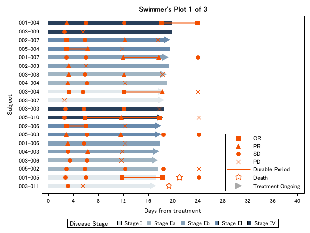
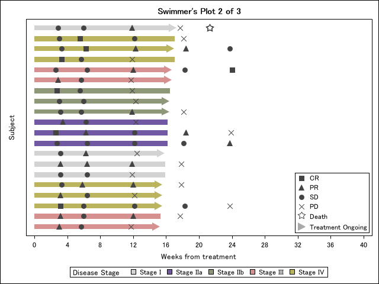
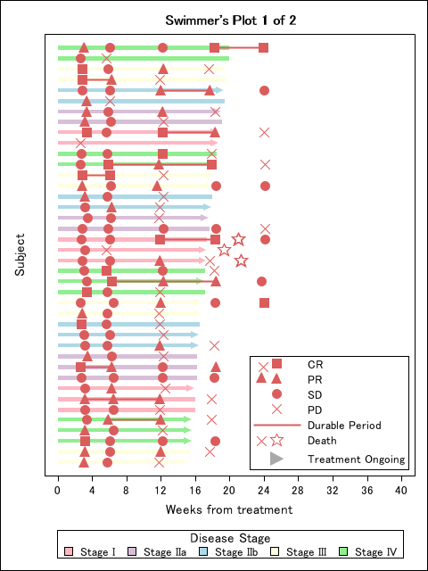

# OncoPlotter (Latest version 0.2.0 on 5July2025)
A SAS package to create figures commonly created in oncology studies  
  

The repository is a collaborative project.
 - **%kaplan_meier_plot**
 - **%swimmer_plot**

---

# `%kaplan_meier_plot</a> 
 
Macro:       %kaplan_meier_plot 
 
Purpose:     This macro generates Kaplan-Meier survival plots using PROC LIFETEST in SAS. 
              It produces survival curves by group, displays censoring marks, and includes 
              the number at risk at each time point on the plot. 
 
 Features: 
   - Optionally generates an internal example dataset (e.g., `dummy_adtte`) 
   - Customizable group labels, colors, and line patterns 
   - Supports plotting of censored observations 
   - Configurable axis and display settings 
   - Supports MFILE option to export generated SAS code 
 
 Parameters: 
   data=                  Input dataset name (e.g., dummy_adtte) 
   groupn=                Numeric group variable (e.g., TRTPN) 
   groupc=                Character group label variable (e.g., TRTP) 
   wh=                    WHERE condition to subset data (optional) 
   Time_var=              Time-to-event variable (e.g., AVAL) 
   Censore_var=           Censoring indicator variable (e.g., CNSR) 
   Censore_val=           Value indicating censored observations (e.g., 1) 
   Title=                 Plot title (default: "Kaplan-Meier Plot") 
   Group_color_list=      Color list for group lines (e.g., "black red blue green") 
   Group_linepattern_list= Line pattern list for groups (e.g., "solid dash longdash dot") 
   XLABEL=                Label for the X-axis (e.g., "Survival Time (Month)") 
   YLABEL=                Label for the Y-axis (e.g., "Probability of Survival") 
   AxisValues=            Tick marks for the X-axis (e.g., "0 to 16 by 2") 
   Generate_Code=         Option to output MFILE-generated SAS code (Y/N) 
 
 Example usage: 
%kaplan_meier_plot( );
  

 

 
👆When run without specifying anything, it automatically draws with dummy data and even opens plain SAS code as text. 
  
 %kaplan_meier_plot( 
       data = dummy_adtte, 
       groupn = TRTPN, 
       groupc = TRTP, 
       Time_var = AVAL, 
       Censore_var = CNSR, 
       Censore_val = 1, 
       Title = %nrquote(Kaplan-Meier Curve Example), 
       Group_color_list = %nrquote(black red blue green), 
       Group_linepattern_list = %nrquote(solid dash longdash shortdash), 
       XLABEL = %nrquote(Survival Time (Month)), 
       YLABEL = %nrquote(Probability), 
       AxisValues = %nrquote(0 to 15 by 1), 
       Generate_Code = N 
   ); 
   
 

 Author:     Yutaka Morioka 
 Date:        2025-06-24 
 Version:     0.1 

# `%swimmer_plot</a> 
 
Macro:       %swimmer_plot 
 
Purpose:     This macro generates swimmer's plot using proc sgplot.   
            You can run the example code below since ADSL_DUMMY and ADRS_DUMMY datasets are created under WORK library when you load OncoPlotter.  
             
~~~sas
%Swimmer_Plot(
	adrs            = adrs_dummy,
	adsl            = adsl_dummy,
	whr_adrs        = PARAM="Overall Response" and PARQUAL="IRC",
	whr_adsl        = FASFL="Y",
	eotvar          = EOTSTT,
	lstvstdt        = ,
	crprN           = 1 2,
	durable         = Y,
	durableLabel    = Durable Period,
	groupvar        = STAGEN,
	groupLabel      = Disease Stage,
	groupN          = 1 2 3 4 5,
	groupC          = Stage I | Stage IIa | Stage IIb | Stage III | Stage IV,
	responseN       = 1 2 3 4,
	responseC       = CR | PR | SD | PD,
	responseLabel   = Response,
	deathLabel      = Death,
	ongoingLabel    = Treatment Ongoing,
	nperpage        = 20,
	width           = 640,
	height          = 480,
	subjidOn        = Y,
	colorStyle      = OncoPlotter, /* Choose from OncoPlotter, Salmon, Kawaii, Kyoto, Osaka */
	groupColor      = ,
	markerColor     = ,
	markerSymbol    = ,
	title           = Swimmer%str(%')s Plot,
	ytitle          = Subject,
	xtitle          = Days from treatment,
	xvalues         = 0 to 40 by 4,
	nolegend        = ,
	interval        = week /* null for Day. Choose from Week, Month to show week or month view */
)
~~~
**Example 1. colorStyle=OncoPlotter (with durable line)**  
  
**Example 2. colorStyle=Kyoto (without durable line)**  
  
**Example 3. colorStyle=Kawaii (Portlait view adjusted by width/height)**   
  

 Author:     Ryo Nakaya 
 Date:        2025-07-05 
 Version:     0.1 

---
 
## Version history  
0.2.0(5July2025)  : added swimmer plot  
0.1.0(24June2025)	: Initial version

## What is SAS Packages?
OncoPlotter is built on top of **SAS Packages framework(SPF)** developed by Bartosz Jablonski.  
For more information about SAS Packages framework, see [SAS_PACKAGES](https://github.com/yabwon/SAS_PACKAGES).  
You can also find more SAS Packages(SASPACs) in [SASPAC](https://github.com/SASPAC).
