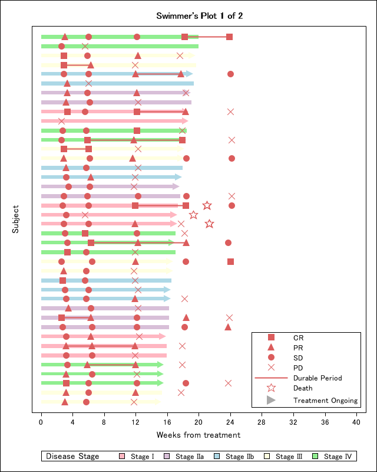

# OncoPlotter (Latest version 0.3.3 on 16Seq2025)
A SAS package to create figures commonly created in oncology studies  
  

The repository is a collaborative project.
 - **%kaplan_meier_plot**
 - **%swimmer_plot**
 - **%waterfall_plot**
  
---

# %kaplan_meier_plot</a> 
 
Macro:       %kaplan_meier_plot 
 
Purpose:     This macro generates Kaplan-Meier survival plots using PROC LIFETEST in SAS. 
              It produces survival curves by group, displays censoring marks, and includes 
              the number at risk at each time point on the plot. 
 
 Features: 
   - Optionally generates an internal example dataset (e.g., `dummy_adtte`) 
   - Customizable group labels, colors, and line patterns 
   - Supports plotting of censored observations 
   - Configurable axis and display settings 
   - Supports MFILE option to export generated SAS code 
 
 Parameters: 
   data=                  Input dataset name (e.g., dummy_adtte) 
   groupn=                Numeric group variable (e.g., TRTPN) 
   groupc=                Character group label variable (e.g., TRTP) 
   wh=                    WHERE condition to subset data (optional) 
   Time_var=              Time-to-event variable (e.g., AVAL) 
   Censore_var=           Censoring indicator variable (e.g., CNSR) 
   Censore_val=           Value indicating censored observations (e.g., 1) 
   Title=                 Plot title (default: "Kaplan-Meier Plot") 
   Group_color_list=      Color list for group lines (e.g., "black red blue green") 
   Group_linepattern_list= Line pattern list for groups (e.g., "solid dash longdash dot") 
   XLABEL=                Label for the X-axis (e.g., "Survival Time (Month)") 
   YLABEL=                Label for the Y-axis (e.g., "Probability of Survival") 
   AxisValues=            Tick marks for the X-axis (e.g., "0 to 16 by 2") 
   Generate_Code=         Option to output MFILE-generated SAS code (Y/N) 
 
 Example usage: 
%kaplan_meier_plot( );
  

 

 
👆When run without specifying anything, it automatically draws with dummy data and even opens plain SAS code as text. 
  
 %kaplan_meier_plot( 
       data = dummy_adtte, 
       groupn = TRTPN, 
       groupc = TRTP, 
       Time_var = AVAL, 
       Censore_var = CNSR, 
       Censore_val = 1, 
       Title = %nrquote(Kaplan-Meier Curve Example), 
       Group_color_list = %nrquote(black red blue green), 
       Group_linepattern_list = %nrquote(solid dash longdash shortdash), 
       XLABEL = %nrquote(Survival Time (Month)), 
       YLABEL = %nrquote(Probability), 
       AxisValues = %nrquote(0 to 15 by 1), 
       Generate_Code = N 
   ); 
   
 

 Author:     Yutaka Morioka 
 Date:        2025-06-24 
 Update Date:  2025-09-16 
 Version:     0.3.3 

# %swimmer_plot</a> 
 
Macro:       %swimmer_plot 
 
Purpose:     This macro generates swimmer's plot using proc sgplot with modern views which address not only CSR figures but also publication figures.   
            You can run the example code below since ADSL_DUMMY and ADRS_DUMMY datasets are created under WORK library when you load OncoPlotter.  
             
~~~sas
%Swimmer_Plot(
	adrs            = adrs_dummy,
	adsl            = adsl_dummy,
	whr_adrs        = PARAM="Overall Response" and PARQUAL="IRC",
	whr_adsl        = FASFL="Y",
	eotvar          = EOTSTT,
	lstvstdt        = ,
	crprN           = 1 2,
	durable         = Y,
	durableLabel    = Durable Period,
	groupvar        = STAGEN,
	groupLabel      = Disease Stage,
	groupN          = 1 2 3 4 5,
	groupC          = Stage I | Stage IIa | Stage IIb | Stage III | Stage IV,
	responseN       = 1 2 3 4,
	responseC       = CR | PR | SD | PD,
	responseLabel   = Response,
	deathLabel      = Death,
	ongoingLabel    = Treatment Ongoing,
	nperpage        = 20,
	width           = 640,
	height          = 480,
	subjidOn        = Y,
	colorStyle      = OncoPlotter, /* Choose from OncoPlotter, Salmon, Kawaii, Kyoto, Osaka */
	groupColor      = ,
	markerColor     = ,
	markerSymbol    = ,
	title           = Swimmer%str(%')s Plot,
	ytitle          = Subject,
	xtitle          = Days from treatment,
	xvalues         = 0 to 40 by 4,
	nolegend        = ,
	interval        = week, /* null for Day. Choose from Week, Month to show week or month view */
	Generate_Code	= Y
)
~~~
**Example 1. colorStyle=OncoPlotter (with durable line)**  
  
**Example 2. colorStyle=Kyoto (without durable line)**  
  
**Example 3. colorStyle=Kawaii (Portlait view adjusted by width/height)**   
  

 Author:     Ryo Nakaya 
 Date:        2025-09-16 
 Version:     0.3 

# %waterfall_plot</a> 
 
Macro:       %waterfall_plot 
 
Purpose:     This macro generates waterfall plot using proc sgplot with modern views which address not only CSR figures but also publication figures.   
            You can run the example code below since ADSL, ADTR and ADRS datasets are created under WORK library when you load OncoPlotter.  

~~~sas
Parameters:
  adrs=           Input response dataset (e.g., ADRS with BOR)
  adtr=           Tumor measurements dataset (e.g., ADTR with SUMDIA)
  adsl=           Subject-level dataset (e.g., ADSL)

  whr_adrs=       where condition for selecting best response per subject (e.g. PARAMCD="BOR" and ANL01FL="Y")
  whr_adtr=       where condition to select the best sum of diameters per subject (e.g. PARAMCD="SUMDIA" and ANL01FL="Y")
  whr_adsl=       where condition for subject-level data (e.g. FASFL="Y")

  groupVar=       Numeric variable used for grouping subjects (e.g., based on BOR)
  groupLabel=     Character variable used for group labels (e.g., BOR term)
  groupN=         List of numeric group values (e.g., 1 2 3)
  groupC=         List of character group labels (e.g., "CR" "PR" "SD")
  groupColor=     Color list for group bars (e.g., red blue green)

  responseVar=    Numeric variable plotted on Y-axis (e.g., PCHG[percent change in tumor size])
  varWidth=       Width of var (default: 0.7)

  width=          Width of the plot in pixels (default: 840)
  height=         Height of the plot in pixels (default: 480)
  dpi=            DPI of the plot  (default: 300)

  title=          Title of the plot (e.g., "Waterfall Plot of Tumor Shrinkage")
  ytitle=         Label for the Y-axis (e.g., "Change from Baseline (%)")
  yvalues=        Range and increment for the Y-axis (e.g., -100 to 100 by 20)
  y_refline=      Referrence line (e.g. -30 20)

  Generate_Code=  Option to output generated SAS code (Y/N)
~~~

**Example.**  
~~~sas

%Waterfall_Plot(
  adrs      = adrs_dummy,
  adtr      = adtr_dummy,
  adsl      = adsl_dummy,

  whr_adrs    = PARAM="Best Overall Response",
  whr_adtr    = PARAM="Sum of Diameters" and PARQUAL="IRC" and TRGRPID="TARGET" and ANL01FL="Y",
  whr_adsl    = FASFL="Y",

  groupVar     = AVAL,
  groupN       = 1 2 3 4,
  groupC       = CR | PR | SD | PD,
  groupLabel   = Best Overall Response:,
  groupColor   = green | blue | gray | red,

  responseVar  = PCHG,
  VarWidth     = 0.7,

  width     = 840,
  height    = 480,
  dpi       = 300, 

  title   = ,         
  ytitle  = Change from Baseline (%), 
  yvalues = -100 to 100 by 20,  
  y_refline=20 40,                

  Generate_Code = Y
);
~~~
**output image. **  
  

 Author:     Hiroki Yamanobe 
 Date:        2025-08-25 
 Version:     0.1 

---
 
## Version history  
0.3.3(16Sep2025)	: A bug fixed for Generate_code parameter to be used in case of Linux  
0.3.2(01Sep2025)	: A bug fixed and made modification to &data parameter of Kaplan-Meier Plot  
0.3.1(25Aug2025)	: Added parameter [VARWIDTH], [DPI], [Y_REFLINE] in waterfall plot. And fixed adrs_dummy.  
0.3.0(30July2025)	: Added waterfall plot  
0.2.2(23July2025)	: A bug fixed and made modification to handle no groupvar in swimmer plot  
0.2.1(14July2025)	: Added functionality of output generated SAS codes to swimmer plot  
0.2.0(5July2025)	: added swimmer plot  
0.1.0(24June2025)	: Initial version

## What is SAS Packages?
OncoPlotter is built on top of **SAS Packages framework(SPF)** developed by Bartosz Jablonski.  
For more information about SAS Packages framework, see [SAS_PACKAGES](https://github.com/yabwon/SAS_PACKAGES).  
You can also find more SAS Packages(SASPACs) in [SASPAC](https://github.com/SASPAC).  

## How to use SAS Packages? (quick start)
### 1. Set-up SPF(SAS Packages Framework)
Firstly, create directory for your packages and assign a fileref to it.
~~~sas      
filename packages "\path\to\your\packages";
~~~
Secondly, enable the SAS Packages Framework.  
(If you don't have SAS Packages Framework installed, follow the instruction in [SPF documentation](https://github.com/yabwon/SAS_PACKAGES/tree/main/SPF/Documentation) to install SAS Packages Framework.)  
~~~sas      
%include packages(SPFinit.sas)
~~~  
### 2. Install SAS package  
Install SAS package you want to use using %installPackage() in SPFinit.sas.
~~~sas      
%installPackage(packagename, sourcePath=\github\path\for\packagename)
~~~
(e.g. %installPackage(ABC, sourcePath=https://github.com/XXXXX/ABC/raw/main/))  
### 3. Load SAS package  
Load SAS package you want to use using %loadPackage() in SPFinit.sas.
~~~sas      
%loadPackage(packagename)
~~~
### Enjoy😁
---
